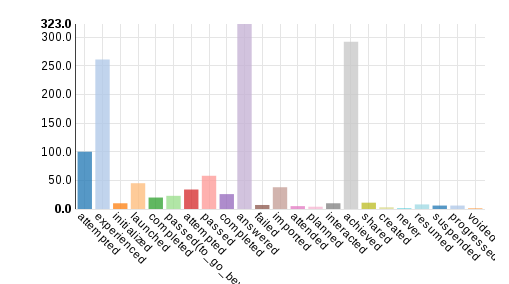
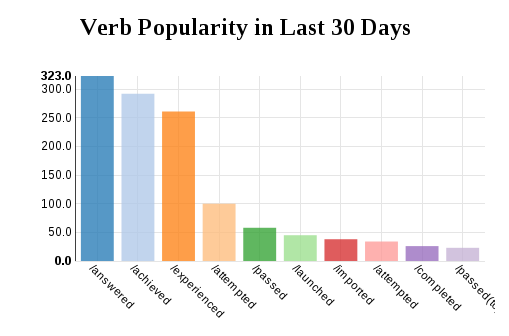

# xAPI-Dashboard

This project attempts to simplify the process of extracting meaningful aggregate data from
Experience API statements. It is composed of two parts. The first part, the *Collection* class,
allows developers to run SQL-like queries, filters, and aggregations over xAPI data. The second
part, the *XAPIDashboard* class, can generate numerous types of charts and visualizations based on
that aggregated xAPI data.

If you'd rather learn by reference, we have a set of live demos at this repo's
[Github.io](https://adlnet.github.io/xAPI-Dashboard) page.

## Making Your First Chart

Generating your first chart is easy. First, include the libraries:

```html
<link rel="stylesheet" href="lib/nv.d3.css"></link>
<script type="text/javascript" src="dist/xapidashboard.min.js"></script>
<script type="text/javascript" src="dist/xapicollection.min.js"></script>
```

Next, you should fetch your data from an LRS. You can either retrieve them yourself, or use the
convenience function provided by the dashboard object:

```javascript
var wrapper = ADL.XAPIWrapper;
wrapper.changeConfig({"endpoint" : 'https://lrs.adlnet.gov/xAPI/'});
var dash = new ADL.XAPIDashboard();

window.onload = function(){
	// get all statements made in the last two weeks
	var query = {'since': new Date(Date.now() - 1000*60*60*24*30).toISOString()};
	dash.fetchAllStatements(query, fetchDoneCallback);
};
```

Now that your data is loaded, the real magic happens:

```javascript
function fetchDoneCallback(){
	var chart = dash.createBarChart({
		container: '#graphContainer svg',
		groupBy: 'verb.id',
		aggregate: ADL.count(),
		customize: function(chart){
			chart.xAxis.rotateLabels(45);
			chart.xAxis.tickFormat(function(d){ return /[^\/]+$/.exec(d)[0]; });
		}
	});
	chart.draw();
}
```

This generates a bar graph (`dash.createBarChart`), places it in a particular place in the DOM
(`'#graphContainer svg'`), and populates it with your previously fetched data. Each bar
corresponds with a unique value of a specified section in the statements (in this example,
`groupBy: 'verb.id'`), and each bar's height is the number of statements with that value
(e.g. `aggregate: ADL.count()`).

An additional `customize` function is specified to format the graph labels. The customization
is all done via the NVD3 chart library. In this case, we tilt the labels 45 degress so they don't 
overlap, and since we don't want the full verb id URIs, we strip off everything before the last
slash.

Finally, once the chart is configured, we call the `draw()` function to actually render the graph
to the document. 

After all that effort, the final result was worth it:



It's still not perfect though. It would be nice if the bars were sorted by height. This is simple
to do using the provided *Collection* methods.

## Processing the Data

This package includes the *ADL.Collection* object, a powerful statement processor. It comes in two
forms, *ADL.CollectionSync* and *ADL.CollectionAsync*. They have the same API, and their usage is
simple. Just load your statements into it automatically like we did above:

```javascript
dash.fetchAllStatements(query, callback);
```

Or manually:

```javascript
var ret = ADL.XAPIWrapper.getStatements(...);
var statements = new ADL.Collection(ret.statements);
```

You can then run filters on the statements to produce useful and interesting summaries. For
example, to get the list of activities performed in the set of statements, you could run:

```javascript
var activities = statements
	// remove statements with duplicate object ids
	.groupBy('object.id')
	// and then pick out the ids
	.select('group');

// run the query, and what do you get?
activities.exec(function(data){
	console.log(data);
});
>>> [{group: 'act_id1'}, {group: 'act_id2'}]
```

And if you wanted a list of the top 10 highest-scoring actors, you could run:

```javascript
var actors = statements
	// take all the statements for each actor
	.groupBy('actor.name')
	// get their best score
	.max('result.score.raw')
	// then sort the actors by those scores, high to low
	.orderBy('max', 'descending')
	// pick out only the first (highest) 10 scorers
	.slice(0,10)
	// and discard all the parts of the statements you won't be using
	.select('group, max');

// run the query, and what do you get?
actors.exec(function(data){
	console.log(data);
});
>>> 
[{'group': 'James Bond', 'max': 94},
 {'group': 'Dr. No',     'max': 88},
 ...
]
```


## Putting It All Together

So to finish our chart, we want to sort the bars by height, and for good measure limit the number
of bars to 10. We can do all of this by providing a post-format hook to our `createBarChart` call:

```javascript
var chart = dash.createBarChart({
	container: '#graphContainer svg',
	groupBy: 'verb.id',
	aggregate: ADL.count(),
	post: function(data){
		data.orderBy('result.count', 'descending')
			.slice(0,10);
	},
	customize: function(chart){
		chart.xAxis.rotateLabels(45);
		chart.xAxis.tickFormat(function(d){ return /\/[^\/]+$/.exec(d)[0]; });
	}
});
chart.draw();
```

This function performs custom processing on the data before it is presented to the charting
software. First we sort the data by the `result.count` field, then filter the set down to 10
elements.

Throw a header on there, and we get this final result:




## Resources

* [Live Demos](https://adlnet.github.io/xAPI-Dashboard)
* [Collection API documentation](API_collection.md)
* [Dashboard API documentation](API_dashboard.md)
* [NVD3 website](http://nvd3.org/index.html)
* [D3 website](http://d3js.org/)

## License
   Copyright &copy;2016 Advanced Distributed Learning

   Licensed under the Apache License, Version 2.0 (the "License");
   you may not use this file except in compliance with the License.
   You may obtain a copy of the License at

       http://www.apache.org/licenses/LICENSE-2.0

   Unless required by applicable law or agreed to in writing, software
   distributed under the License is distributed on an "AS IS" BASIS,
   WITHOUT WARRANTIES OR CONDITIONS OF ANY KIND, either express or implied.
   See the License for the specific language governing permissions and
   limitations under the License.
