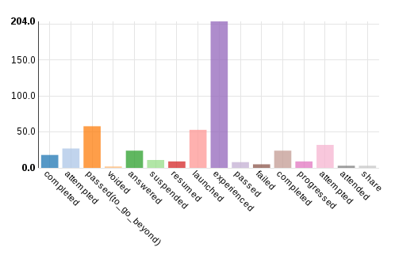
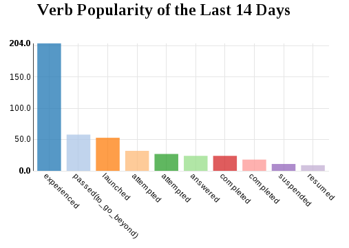

# xAPI-Dashboard

Provides a quick and easy way to generate graphs from your xAPI data, as well as a powerful
query language to manipulate it.


## Making Your First Chart

Generating your first chart is easy. First, include the libraries:

```html
<script src="d3.v3.min.js"></script>
<script src="nvd3/nv.d3.js"></script>
<link rel='stylesheet' href='nvd3/nv.d3.css'></link>
<script type="text/javascript" src="xAPIWrapper/xapiwrapper.min.js"></script>
<script type="text/javascript" src="collection.js"></script>
<script type="text/javascript" src="dashboard.js"></script>
```

Next, you should fetch your data from an LRS. You can either retrieve them yourself, or use the
convenience function provided by the dashboard object:

```javascript
var wrapper = ADL.XAPIWrapper;
wrapper.changeConfig({"endpoint" : 'https://lrs.adlnet.gov/xAPI/'});
var dash = new ADL.XAPIDashboard(),
	set = ADL.Collection;

window.onload = function(){
	// get all statements made in the last two weeks
	var query = {'since': new Date(Date.now() - 1000*60*60*24*14).toISOString()};
	dash.fetchAllStatements(query, fetchDoneCallback);
};
```

Now that your data is loaded, the real magic happens:

```javascript
function fetchDoneCallback(){
	dash.genBarGraph('#graphContainer svg', {
		groupField: 'verb.id',
		customize: function(chart){
			chart.margin({'bottom': 100}).staggerLabels(false);
			chart.xAxis.rotateLabels(45);
			chart.xAxis.tickFormat(function(d){ return /[^\/]+$/.exec(d)[0]; });
		}
	});
}
```

This generates a bar graph (`dash.genBarGraph`), places it in a particular place in the DOM
(`'#graphContainer svg'`), and populates it with your previously fetched data. Each bar
corresponds with a unique value of a specified section in the statements (in this example,
`groupField: 'verb.id'`), and each bar's height is the number of statements with that value.

An additional `customize` function is specified to format the graph labels. The customization
is all done via the NVD3 chart library. In this case, we apply a bottom margin, tilt the labels
45 degress so they don't overlap, and since we don't want the full verb id URIs, we strip off
everything before the last slash.

After all that effort, the final result was worth it:



It's still not perfect though. It would be nice if the bars were sorted by height. This is simple
to do using the provided *Collection* methods.

## Processing the Data

This package includes the *ADL.Collection* object, a powerful statement processor. Its usage is
simple. Just load your statements into it automatically like we did above:

```javascript
dash.fetchAllStatements(query, callback);
```

Or manually:

```javascript
var ret = ADL.XAPIWrapper.getStatements(...);
var statements = new ADL.Collection(ret.statements);
```

You can then run filters on the statements to produce useful and interesting summaries. For
example, to get the list of activities performed in the set of statements, you could run:

```javascript
var activities = statements
	// remove statements with duplicate object ids
	.selectDistinct('object.id')
	// and then pick out the ids
	.transform(
		ADL.Collection.getValue('object.id')
	);
console.log(activities.contents);
>>> ['objectId1','objectId2']
```

And if you wanted a list of the top 10 highest-scoring actors, you could run:

```javascript
var actors = statements
	// take all the statements for each actor
	.groupBy('actor.name', function(subset){
		// and find the highest score.raw
		return subset.max('score.raw');
	})
	// then sort by those scores, high to low
	.orderBy('result', 'descending')
	// and pick out only the first (highest) 10 scores
	.select(ADL.Collection.first(10));
	
console.log(groups.contents);
>>> 
[{'groupValue': 'James Bond', 'result': 94},
 {'groupValue': 'Dr. No',     'result': 88},
 ...
]
```


## Putting It All Together

So to finish our chart, we want to sort the bars by height, and for good measure limit the number
of bars to 10. We can do all of this by providing a post-format hook to our `genBarChart` call:

```javascript
dash.genBarGraph('#graphContainer svg', {
	groupField: 'verb.id',
	post: function(data){
		return data
			.orderBy('result.count', 'descending')
			.select(ADL.Collection.first(10));
	},
	customize: function(chart){
		chart.margin({'bottom': 100}).staggerLabels(false);
		chart.xAxis.rotateLabels(45);
		chart.xAxis.tickFormat(function(d){ return /[^\/]+$/.exec(d)[0]; });
	}
});
```

This function performs custom processing on the data before it is presented to the charting
software. First we sort the data by the `result.count` field, then filter the set down to 10
elements.

Throw a header on there, and we get this final result:




## Resources

* [Full API documentation](API.md)
* [NVD3 website](http://nvd3.org/index.html)
* [D3 website](http://d3js.org/)